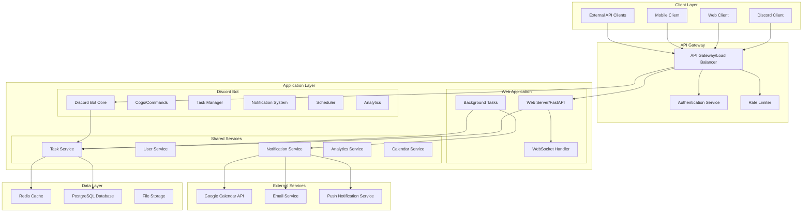

# Design Document

## Overview

This design document outlines the architecture for enhancing the existing Discord Task Management Bot with multi-user collaboration features, a comprehensive web-based GUI, advanced analytics, and improved integrations. The enhancement builds upon the existing modular cog-based architecture while introducing new components for web interface, API layer, and enhanced data management.

The system will maintain backward compatibility with the existing Discord bot functionality while adding new capabilities through a modern web application, RESTful API, and enhanced database schema.

## Architecture

### High-Level Architecture



### Technology Stack

**Backend:**
- **Discord Bot**: Python 3.11+ with discord.py
- **Web Framework**: FastAPI with async support
- **Database**: PostgreSQL 14+ with asyncpg
- **Cache**: Redis 7+ for session management and real-time features
- **Task Queue**: Celery with Redis broker for background tasks
- **Authentication**: OAuth2 (Discord) + JWT tokens

**Frontend:**
- **Framework**: React 18+ with TypeScript
- **UI Library**: Material-UI (MUI) or Tailwind CSS
- **State Management**: Redux Toolkit + RTK Query
- **Real-time**: Socket.IO client for WebSocket connections
- **Charts**: Chart.js or Recharts for analytics visualization
- **Mobile**: Progressive Web App (PWA) capabilities

**Infrastructure:**
- **Containerization**: Docker with docker-compose for development
- **Reverse Proxy**: Nginx for production deployment
- **Process Management**: PM2 or systemd for service management
- **Monitoring**: Prometheus + Grafana for metrics
- **Logging**: Structured logging with ELK stack integration

**Development Environment:**
- **Virtual Environment**: Python .venv for dependency isolation
- **Environment Configuration**: .env files for environment-specific settings
- **Package Management**: pip with requirements.txt and requirements-dev.txt
- **Code Quality**: Black, isort, flake8, mypy for code formatting and linting

## Components and Interfaces

### 1. Enhanced Database Schema

#### New Tables for Multi-User Collaboration

```sql
-- Task assignments for multi-user collaboration
CREATE TABLE task_assignments (
    id SERIAL PRIMARY KEY,
    task_id INTEGER REFERENCES tasks(id) ON DELETE CASCADE,
    assigned_user_id TEXT NOT NULL,
    assigned_by_user_id TEXT NOT NULL,
    assigned_at TIMESTAMP DEFAULT CURRENT_TIMESTAMP,
    status VARCHAR(20) DEFAULT 'assigned', -- assigned, accepted, declined, completed
    completion_notes TEXT,
    completed_at TIMESTAMP,
    UNIQUE(task_id, assigned_user_id)
);

-- Task collaboration messages
CREATE TABLE task_messages (
    id SERIAL PRIMARY KEY,
    task_id INTEGER REFERENCES tasks(id) ON DELETE CASCADE,
    user_id TEXT NOT NULL,
    message TEXT NOT NULL,
    message_type VARCHAR(20) DEFAULT 'comment', -- comment, status_update, system
    created_at TIMESTAMP DEFAULT CURRENT_TIMESTAMP,
    edited_at TIMESTAMP,
    parent_message_id INTEGER REFERENCES task_messages(id)
);

-- Task templates for automation
CREATE TABLE task_templates (
    id SERIAL PRIMARY KEY,
    created_by_user_id TEXT NOT NULL,
    name VARCHAR(255) NOT NULL,
    description TEXT,
    default_duration_minutes INTEGER DEFAULT 15,
    default_priority BOOLEAN DEFAULT FALSE,
    template_data JSONB, -- Stores template configuration
    is_shared BOOLEAN DEFAULT FALSE,
    created_at TIMESTAMP DEFAULT CURRENT_TIMESTAMP,
    updated_at TIMESTAMP DEFAULT CURRENT_TIMESTAMP
);

-- Recurring task configurations
CREATE TABLE recurring_tasks (
    id SERIAL PRIMARY KEY,
    template_id INTEGER REFERENCES task_templates(id) ON DELETE CASCADE,
    user_id TEXT NOT NULL,
    recurrence_pattern JSONB, -- Stores cron-like pattern
    next_creation_date TIMESTAMP,
    is_active BOOLEAN DEFAULT TRUE,
    created_at TIMESTAMP DEFAULT CURRENT_TIMESTAMP
);

-- User sessions for web interface
CREATE TABLE user_sessions (
    id SERIAL PRIMARY KEY,
    user_id TEXT NOT NULL,
    session_token VARCHAR(255) UNIQUE NOT NULL,
    discord_token TEXT, -- Encrypted Discord OAuth token
    expires_at TIMESTAMP NOT NULL,
    created_at TIMESTAMP DEFAULT CURRENT_TIMESTAMP,
    last_activity TIMESTAMP DEFAULT CURRENT_TIMESTAMP,
    ip_address INET,
    user_agent TEXT
);

-- API keys for external integrations
CREATE TABLE api_keys (
    id SERIAL PRIMARY KEY,
    user_id TEXT NOT NULL,
    key_name VARCHAR(100) NOT NULL,
    api_key_hash VARCHAR(255) NOT NULL,
    permissions JSONB, -- Array of allowed permissions
    last_used_at TIMESTAMP,
    expires_at TIMESTAMP,
    is_active BOOLEAN DEFAULT TRUE,
    created_at TIMESTAMP DEFAULT CURRENT_TIMESTAMP
);

-- Enhanced analytics tables
CREATE TABLE productivity_goals (
    id SERIAL PRIMARY KEY,
    user_id TEXT NOT NULL,
    goal_type VARCHAR(50) NOT NULL, -- completion_rate, daily_tasks, time_management
    target_value DECIMAL(10,2) NOT NULL,
    current_value DECIMAL(10,2) DEFAULT 0,
    period_type VARCHAR(20) DEFAULT 'weekly', -- daily, weekly, monthly
    start_date DATE NOT NULL,
    end_date DATE,
    is_active BOOLEAN DEFAULT TRUE,
    created_at TIMESTAMP DEFAULT CURRENT_TIMESTAMP
);

CREATE TABLE user_activity_log (
    id SERIAL PRIMARY KEY,
    user_id TEXT NOT NULL,
    activity_type VARCHAR(50) NOT NULL,
    activity_data JSONB,
    source VARCHAR(20) NOT NULL, -- discord, web, api
    ip_address INET,
    created_at TIMESTAMP DEFAULT CURRENT_TIMESTAMP
);
```

#### Enhanced Existing Tables

```sql
-- Add collaboration fields to existing tasks table
ALTER TABLE tasks ADD COLUMN IF NOT EXISTS is_collaborative BOOLEAN DEFAULT FALSE;
ALTER TABLE tasks ADD COLUMN IF NOT EXISTS created_by_user_id TEXT;
ALTER TABLE tasks ADD COLUMN IF NOT EXISTS collaboration_notes TEXT;
ALTER TABLE tasks ADD COLUMN IF NOT EXISTS completion_percentage INTEGER DEFAULT 0;

-- Add web-specific fields to notification_preferences
ALTER TABLE notification_preferences ADD COLUMN IF NOT EXISTS email_notifications BOOLEAN DEFAULT FALSE;
ALTER TABLE notification_preferences ADD COLUMN IF NOT EXISTS web_push_notifications BOOLEAN DEFAULT TRUE;
ALTER TABLE notification_preferences ADD COLUMN IF NOT EXISTS email_address VARCHAR(255);

-- Add template reference to tasks
ALTER TABLE tasks ADD COLUMN IF NOT EXISTS template_id INTEGER REFERENCES task_templates(id);
ALTER TABLE tasks ADD COLUMN IF NOT EXISTS recurring_task_id INTEGER REFERENCES recurring_tasks(id);
```

### 2. Service Layer Architecture

#### Task Service Interface

```python
from abc import ABC, abstractmethod
from typing import List, Dict, Optional
from datetime import datetime, date

class TaskServiceInterface(ABC):
    @abstractmethod
    async def create_task(self, user_id: str, task_data: Dict) -> Dict:
        """Create a new task"""
        pass
    
    @abstractmethod
    async def assign_task_to_users(self, task_id: int, user_ids: List[str], assigned_by: str) -> bool:
        """Assign task to multiple users"""
        pass
    
    @abstractmethod
    async def get_collaborative_tasks(self, user_id: str) -> List[Dict]:
        """Get tasks where user is assigned or collaborating"""
        pass
    
    @abstractmethod
    async def update_task_progress(self, task_id: int, user_id: str, progress: int, notes: str = None) -> bool:
        """Update task completion progress"""
        pass
    
    @abstractmethod
    async def add_task_message(self, task_id: int, user_id: str, message: str, message_type: str = 'comment') -> Dict:
        """Add message to task collaboration thread"""
        pass

class TaskService(TaskServiceInterface):
    def __init__(self, db_manager, cache_manager, notification_service):
        self.db = db_manager
        self.cache = cache_manager
        self.notification_service = notification_service
    
    async def create_task(self, user_id: str, task_data: Dict) -> Dict:
        """Enhanced task creation with collaboration support"""
        # Create base task
        task_id = await self.db.create_task(user_id, task_data)
        
        # Handle multi-user assignment
        if task_data.get('assigned_users'):
            await self.assign_task_to_users(
                task_id, 
                task_data['assigned_users'], 
                user_id
            )
        
        # Cache task data
        await self.cache.set_task(task_id, task_data)
        
        # Send notifications
        await self.notification_service.notify_task_created(task_id, user_id)
        
        return await self.get_task_by_id(task_id, user_id)
```

#### Notification Service Interface

```python
class NotificationServiceInterface(ABC):
    @abstractmethod
    async def send_discord_notification(self, user_id: str, message: Dict) -> bool:
        """Send Discord DM notification"""
        pass
    
    @abstractmethod
    async def send_email_notification(self, user_id: str, email_data: Dict) -> bool:
        """Send email notification"""
        pass
    
    @abstractmethod
    async def send_web_push_notification(self, user_id: str, push_data: Dict) -> bool:
        """Send web push notification"""
        pass
    
    @abstractmethod
    async def notify_task_assignment(self, task_id: int, assigned_users: List[str], assigned_by: str) -> None:
        """Notify users about task assignment"""
        pass

class NotificationService(NotificationServiceInterface):
    def __init__(self, discord_bot, email_service, push_service, db_manager):
        self.discord_bot = discord_bot
        self.email_service = email_service
        self.push_service = push_service
        self.db = db_manager
    
    async def notify_task_assignment(self, task_id: int, assigned_users: List[str], assigned_by: str) -> None:
        """Multi-channel notification for task assignments"""
        task = await self.db.get_task_by_id(task_id)
        assigner = await self.db.get_user_by_id(assigned_by)
        
        for user_id in assigned_users:
            user_prefs = await self.db.get_notification_preferences(user_id)
            
            # Discord notification
            if user_prefs.get('task_reminders', True):
                await self.send_discord_notification(user_id, {
                    'type': 'task_assignment',
                    'task': task,
                    'assigned_by': assigner
                })
            
            # Email notification
            if user_prefs.get('email_notifications', False):
                await self.send_email_notification(user_id, {
                    'type': 'task_assignment',
                    'task': task,
                    'assigned_by': assigner
                })
            
            # Web push notification
            if user_prefs.get('web_push_notifications', True):
                await self.send_web_push_notification(user_id, {
                    'type': 'task_assignment',
                    'task': task,
                    'assigned_by': assigner
                })
```

### 3. Web Application Architecture

#### FastAPI Application Structure

```python
from fastapi import FastAPI, Depends, HTTPException, WebSocket
from fastapi.middleware.cors import CORSMiddleware
from fastapi.security import HTTPBearer
import asyncio

app = FastAPI(title="Task Management API", version="2.0.0")

# Middleware
app.add_middleware(
    CORSMiddleware,
    allow_origins=["http://localhost:3000"],  # React dev server
    allow_credentials=True,
    allow_methods=["*"],
    allow_headers=["*"],
)

# Authentication
security = HTTPBearer()

class AuthService:
    async def verify_token(self, token: str) -> Dict:
        """Verify JWT token and return user info"""
        # Implementation for token verification
        pass

# WebSocket Manager for real-time updates
class WebSocketManager:
    def __init__(self):
        self.active_connections: Dict[str, List[WebSocket]] = {}
    
    async def connect(self, websocket: WebSocket, user_id: str):
        await websocket.accept()
        if user_id not in self.active_connections:
            self.active_connections[user_id] = []
        self.active_connections[user_id].append(websocket)
    
    async def disconnect(self, websocket: WebSocket, user_id: str):
        if user_id in self.active_connections:
            self.active_connections[user_id].remove(websocket)
    
    async def send_personal_message(self, message: Dict, user_id: str):
        if user_id in self.active_connections:
            for connection in self.active_connections[user_id]:
                await connection.send_json(message)

websocket_manager = WebSocketManager()

# API Routes
@app.get("/api/v1/tasks")
async def get_tasks(
    user_id: str = Depends(get_current_user),
    status: Optional[str] = None,
    limit: int = 25,
    offset: int = 0
):
    """Get user tasks with pagination and filtering"""
    task_service = get_task_service()
    tasks = await task_service.get_user_tasks(
        user_id=user_id,
        status=status,
        limit=limit,
        offset=offset
    )
    return {"tasks": tasks, "total": len(tasks)}

@app.post("/api/v1/tasks")
async def create_task(
    task_data: TaskCreateRequest,
    user_id: str = Depends(get_current_user)
):
    """Create a new task"""
    task_service = get_task_service()
    task = await task_service.create_task(user_id, task_data.dict())
    
    # Send real-time update
    await websocket_manager.send_personal_message(
        {"type": "task_created", "task": task},
        user_id
    )
    
    return task

@app.websocket("/ws/{user_id}")
async def websocket_endpoint(websocket: WebSocket, user_id: str):
    """WebSocket endpoint for real-time updates"""
    await websocket_manager.connect(websocket, user_id)
    try:
        while True:
            data = await websocket.receive_text()
            # Handle incoming WebSocket messages
            await handle_websocket_message(data, user_id)
    except Exception as e:
        await websocket_manager.disconnect(websocket, user_id)
```

#### React Frontend Architecture

```typescript
// Store configuration with Redux Toolkit
import { configureStore } from '@reduxjs/toolkit';
import { taskApi } from './api/taskApi';
import { authSlice } from './slices/authSlice';
import { uiSlice } from './slices/uiSlice';

export const store = configureStore({
  reducer: {
    auth: authSlice.reducer,
    ui: uiSlice.reducer,
    [taskApi.reducerPath]: taskApi.reducer,
  },
  middleware: (getDefaultMiddleware) =>
    getDefaultMiddleware().concat(taskApi.middleware),
});

// RTK Query API definition
import { createApi, fetchBaseQuery } from '@reduxjs/toolkit/query/react';

export const taskApi = createApi({
  reducerPath: 'taskApi',
  baseQuery: fetchBaseQuery({
    baseUrl: '/api/v1/',
    prepareHeaders: (headers, { getState }) => {
      const token = (getState() as RootState).auth.token;
      if (token) {
        headers.set('authorization', `Bearer ${token}`);
      }
      return headers;
    },
  }),
  tagTypes: ['Task', 'User', 'Analytics'],
  endpoints: (builder) => ({
    getTasks: builder.query<TaskResponse, TaskFilters>({
      query: (filters) => ({
        url: 'tasks',
        params: filters,
      }),
      providesTags: ['Task'],
    }),
    createTask: builder.mutation<Task, CreateTaskRequest>({
      query: (task) => ({
        url: 'tasks',
        method: 'POST',
        body: task,
      }),
      invalidatesTags: ['Task'],
    }),
    getAnalytics: builder.query<AnalyticsData, AnalyticsFilters>({
      query: (filters) => ({
        url: 'analytics',
        params: filters,
      }),
      providesTags: ['Analytics'],
    }),
  }),
});

// WebSocket hook for real-time updates
import { useEffect, useRef } from 'react';
import { useAppDispatch } from './hooks';

export const useWebSocket = (userId: string) => {
  const dispatch = useAppDispatch();
  const ws = useRef<WebSocket | null>(null);

  useEffect(() => {
    ws.current = new WebSocket(`ws://localhost:8000/ws/${userId}`);
    
    ws.current.onmessage = (event) => {
      const data = JSON.parse(event.data);
      
      switch (data.type) {
        case 'task_created':
          dispatch(taskApi.util.invalidateTags(['Task']));
          break;
        case 'task_updated':
          dispatch(taskApi.util.updateQueryData('getTasks', {}, (draft) => {
            const index = draft.tasks.findIndex(t => t.id === data.task.id);
            if (index !== -1) {
              draft.tasks[index] = data.task;
            }
          }));
          break;
        case 'notification':
          // Handle real-time notifications
          break;
      }
    };

    return () => {
      ws.current?.close();
    };
  }, [userId, dispatch]);

  return ws.current;
};
```

### 4. Discord Bot Integration

#### Enhanced Cog Architecture

```python
# Enhanced task management cog with collaboration support
class CollaborativeTaskManager(commands.Cog):
    def __init__(self, bot):
        self.bot = bot
        self.task_service = get_task_service()
        self.notification_service = get_notification_service()
    
    @app_commands.command(name="assign", description="Assign a task to multiple users")
    async def assign_task(
        self, 
        interaction: discord.Interaction,
        task_id: int,
        users: str  # Comma-separated user mentions
    ):
        """Assign task to multiple users"""
        user_id = str(interaction.user.id)
        
        # Parse user mentions
        mentioned_users = self.parse_user_mentions(users)
        
        # Verify task ownership or permission
        task = await self.task_service.get_task_by_id(task_id, user_id)
        if not task:
            await interaction.response.send_message("❌ Task not found or no permission", ephemeral=True)
            return
        
        # Assign task to users
        success = await self.task_service.assign_task_to_users(
            task_id, mentioned_users, user_id
        )
        
        if success:
            embed = EmbedBuilder.success_embed(
                "Task Assigned",
                f"Task '{task['description']}' assigned to {len(mentioned_users)} users"
            )
            await interaction.response.send_message(embed=embed)
            
            # Send real-time updates to web clients
            await self.notify_web_clients('task_assigned', {
                'task_id': task_id,
                'assigned_users': mentioned_users,
                'assigned_by': user_id
            })
        else:
            await interaction.response.send_message("❌ Failed to assign task", ephemeral=True)
    
    async def notify_web_clients(self, event_type: str, data: Dict):
        """Send real-time updates to web clients"""
        web_service = get_web_service()
        await web_service.broadcast_event(event_type, data)
```

## Data Models

### Core Data Models

```python
from pydantic import BaseModel, Field
from typing import List, Optional, Dict, Any
from datetime import datetime
from enum import Enum

class TaskStatus(str, Enum):
    PENDING = "pending"
    IN_PROGRESS = "in_progress"
    COMPLETED = "completed"
    CANCELLED = "cancelled"

class TaskPriority(str, Enum):
    LOW = "low"
    NORMAL = "normal"
    HIGH = "high"
    URGENT = "urgent"

class Task(BaseModel):
    id: int
    description: str
    created_by_user_id: str
    assigned_users: List[str] = []
    status: TaskStatus = TaskStatus.PENDING
    priority: TaskPriority = TaskPriority.NORMAL
    due_time: Optional[datetime] = None
    duration_minutes: int = 15
    location: Optional[str] = None
    is_collaborative: bool = False
    completion_percentage: int = 0
    collaboration_notes: Optional[str] = None
    template_id: Optional[int] = None
    recurring_task_id: Optional[int] = None
    created_at: datetime
    updated_at: datetime

class TaskAssignment(BaseModel):
    id: int
    task_id: int
    assigned_user_id: str
    assigned_by_user_id: str
    status: str = "assigned"
    completion_notes: Optional[str] = None
    assigned_at: datetime
    completed_at: Optional[datetime] = None

class TaskMessage(BaseModel):
    id: int
    task_id: int
    user_id: str
    message: str
    message_type: str = "comment"
    created_at: datetime
    edited_at: Optional[datetime] = None
    parent_message_id: Optional[int] = None

class TaskTemplate(BaseModel):
    id: int
    created_by_user_id: str
    name: str
    description: Optional[str] = None
    default_duration_minutes: int = 15
    default_priority: TaskPriority = TaskPriority.NORMAL
    template_data: Dict[str, Any] = {}
    is_shared: bool = False
    created_at: datetime
    updated_at: datetime

class UserPreferences(BaseModel):
    user_id: str
    work_start: str = "09:00"
    work_end: str = "17:00"
    lunch_duration_minutes: int = 30
    time_zone: str = "UTC"
    lunch_window_start: str = "12:00"
    lunch_window_end: str = "14:00"

class NotificationPreferences(BaseModel):
    user_id: str
    task_reminders: bool = True
    overdue_alerts: bool = True
    daily_summaries: bool = True
    email_notifications: bool = False
    web_push_notifications: bool = True
    reminder_minutes: int = 15
    quiet_hours_start: Optional[str] = None
    quiet_hours_end: Optional[str] = None
    email_address: Optional[str] = None

class AnalyticsData(BaseModel):
    user_id: str
    timeframe: str
    tasks_completed: int
    total_tasks: int
    completion_rate: float
    avg_duration: float
    on_time_starts: float
    on_time_finishes: float
    avg_delay: float
    total_time: float
    best_day: str
    peak_hour: int
    current_streak: int
    priority_completion: float
    performance_score: int
```

## Error Handling

### Centralized Error Management

```python
from enum import Enum
from typing import Dict, Any
import logging

class ErrorCode(Enum):
    # Task-related errors
    TASK_NOT_FOUND = "TASK_NOT_FOUND"
    TASK_ACCESS_DENIED = "TASK_ACCESS_DENIED"
    TASK_ALREADY_ASSIGNED = "TASK_ALREADY_ASSIGNED"
    INVALID_TASK_STATUS = "INVALID_TASK_STATUS"
    
    # User-related errors
    USER_NOT_FOUND = "USER_NOT_FOUND"
    INVALID_PERMISSIONS = "INVALID_PERMISSIONS"
    
    # System errors
    DATABASE_ERROR = "DATABASE_ERROR"
    EXTERNAL_SERVICE_ERROR = "EXTERNAL_SERVICE_ERROR"
    RATE_LIMIT_EXCEEDED = "RATE_LIMIT_EXCEEDED"

class TaskManagementException(Exception):
    def __init__(self, error_code: ErrorCode, message: str, details: Dict[str, Any] = None):
        self.error_code = error_code
        self.message = message
        self.details = details or {}
        super().__init__(message)

class ErrorHandler:
    @staticmethod
    async def handle_discord_error(interaction: discord.Interaction, error: Exception):
        """Handle errors in Discord interactions"""
        logger = logging.getLogger(__name__)
        
        if isinstance(error, TaskManagementException):
            embed = EmbedBuilder.error_embed(
                title="Error",
                description=error.message
            )
            
            if error.error_code == ErrorCode.TASK_NOT_FOUND:
                embed.add_field(name="Suggestion", value="Check the task ID and try again", inline=False)
            elif error.error_code == ErrorCode.TASK_ACCESS_DENIED:
                embed.add_field(name="Suggestion", value="You don't have permission to access this task", inline=False)
            
            logger.warning(f"Task management error: {error.error_code} - {error.message}")
        else:
            embed = EmbedBuilder.error_embed(
                title="Unexpected Error",
                description="An unexpected error occurred. Please try again later."
            )
            logger.error(f"Unexpected error in Discord interaction: {error}")
        
        try:
            if interaction.response.is_done():
                await interaction.followup.send(embed=embed, ephemeral=True)
            else:
                await interaction.response.send_message(embed=embed, ephemeral=True)
        except:
            pass  # Fail silently if we can't send the error message
    
    @staticmethod
    async def handle_api_error(error: Exception) -> Dict[str, Any]:
        """Handle errors in API endpoints"""
        if isinstance(error, TaskManagementException):
            return {
                "error": {
                    "code": error.error_code.value,
                    "message": error.message,
                    "details": error.details
                }
            }
        else:
            logging.error(f"Unexpected API error: {error}")
            return {
                "error": {
                    "code": "INTERNAL_SERVER_ERROR",
                    "message": "An internal server error occurred"
                }
            }
```

## Testing Strategy

### Comprehensive Testing Requirements

The testing strategy follows a multi-layered approach with comprehensive unit testing requirements to ensure code quality, reliability, and maintainability.

#### Testing Coverage Requirements

- **Minimum Code Coverage**: 85% for all service layers
- **Critical Path Coverage**: 100% for task creation, assignment, and notification flows
- **API Endpoint Coverage**: 100% for all REST endpoints
- **Discord Command Coverage**: 90% for all bot commands
- **Database Operation Coverage**: 95% for all database queries and transactions

#### Unit Testing Framework and Structure

```python
import pytest
import asyncio
from unittest.mock import AsyncMock, MagicMock, patch
from fastapi.testclient import TestClient
from datetime import datetime, timedelta
import json

# Test configuration
pytest_plugins = ["pytest_asyncio"]

@pytest.fixture(scope="session")
def event_loop():
    """Create an instance of the default event loop for the test session."""
    loop = asyncio.get_event_loop_policy().new_event_loop()
    yield loop
    loop.close()

# Database test fixtures
@pytest.fixture
async def db_manager():
    """Mock database manager with comprehensive method coverage"""
    mock_db = AsyncMock()
    
    # Task operations
    mock_db.create_task.return_value = 1
    mock_db.get_task_by_id.return_value = {
        'id': 1,
        'description': 'Test task',
        'user_id': 'test_user',
        'status': 'pending',
        'created_at': datetime.now(),
        'updated_at': datetime.now()
    }
    mock_db.update_task.return_value = True
    mock_db.delete_task.return_value = True
    mock_db.get_user_tasks.return_value = []
    
    # Collaboration operations
    mock_db.assign_task_to_users.return_value = True
    mock_db.get_task_assignments.return_value = []
    mock_db.add_task_message.return_value = {'id': 1, 'message': 'Test message'}
    
    # User operations
    mock_db.get_user_preferences.return_value = {
        'work_start': '09:00',
        'work_end': '17:00',
        'time_zone': 'UTC'
    }
    mock_db.get_notification_preferences.return_value = {
        'task_reminders': True,
        'email_notifications': False
    }
    
    return mock_db

@pytest.fixture
async def cache_manager():
    """Mock cache manager"""
    mock_cache = AsyncMock()
    mock_cache.get.return_value = None
    mock_cache.set.return_value = True
    mock_cache.delete.return_value = True
    return mock_cache

@pytest.fixture
async def notification_service():
    """Mock notification service"""
    mock_notif = AsyncMock()
    mock_notif.send_discord_notification.return_value = True
    mock_notif.send_email_notification.return_value = True
    mock_notif.send_web_push_notification.return_value = True
    mock_notif.notify_task_assignment.return_value = None
    return mock_notif

@pytest.fixture
async def task_service(db_manager, cache_manager, notification_service):
    """Task service with mocked dependencies"""
    return TaskService(db_manager, cache_manager, notification_service)

# Comprehensive Unit Tests for Service Layer
class TestTaskService:
    """Comprehensive unit tests for TaskService"""
    
    async def test_create_task_success(self, task_service):
        """Test successful task creation"""
        task_data = {
            'description': 'Test task',
            'duration_minutes': 30,
            'priority': 'high',
            'assigned_users': ['user1', 'user2']
        }
        
        result = await task_service.create_task('test_user', task_data)
        
        assert result['id'] == 1
        assert result['description'] == 'Test task'
        task_service.db.create_task.assert_called_once()
        task_service.notification_service.notify_task_created.assert_called_once()
    
    async def test_create_task_validation_error(self, task_service):
        """Test task creation with invalid data"""
        task_data = {
            'description': '',  # Invalid empty description
            'duration_minutes': -5  # Invalid negative duration
        }
        
        with pytest.raises(TaskManagementException) as exc_info:
            await task_service.create_task('test_user', task_data)
        
        assert exc_info.value.error_code == ErrorCode.INVALID_TASK_DATA
    
    async def test_assign_task_to_users_success(self, task_service):
        """Test successful multi-user task assignment"""
        task_id = 1
        user_ids = ['user1', 'user2', 'user3']
        assigned_by = 'admin_user'
        
        result = await task_service.assign_task_to_users(task_id, user_ids, assigned_by)
        
        assert result is True
        task_service.db.assign_task_to_users.assert_called_once_with(task_id, user_ids, assigned_by)
        task_service.notification_service.notify_task_assignment.assert_called_once()
    
    async def test_assign_task_nonexistent_task(self, task_service):
        """Test assignment to non-existent task"""
        task_service.db.get_task_by_id.return_value = None
        
        with pytest.raises(TaskManagementException) as exc_info:
            await task_service.assign_task_to_users(999, ['user1'], 'admin')
        
        assert exc_info.value.error_code == ErrorCode.TASK_NOT_FOUND
    
    async def test_get_collaborative_tasks(self, task_service):
        """Test retrieval of collaborative tasks"""
        user_id = 'test_user'
        expected_tasks = [
            {'id': 1, 'description': 'Collaborative task 1', 'is_collaborative': True},
            {'id': 2, 'description': 'Collaborative task 2', 'is_collaborative': True}
        ]
        task_service.db.get_collaborative_tasks.return_value = expected_tasks
        
        result = await task_service.get_collaborative_tasks(user_id)
        
        assert len(result) == 2
        assert all(task['is_collaborative'] for task in result)
        task_service.db.get_collaborative_tasks.assert_called_once_with(user_id)
    
    async def test_update_task_progress(self, task_service):
        """Test task progress update"""
        task_id = 1
        user_id = 'test_user'
        progress = 75
        notes = 'Making good progress'
        
        result = await task_service.update_task_progress(task_id, user_id, progress, notes)
        
        assert result is True
        task_service.db.update_task_progress.assert_called_once_with(task_id, user_id, progress, notes)
    
    async def test_add_task_message(self, task_service):
        """Test adding message to task collaboration thread"""
        task_id = 1
        user_id = 'test_user'
        message = 'This is a collaboration message'
        
        result = await task_service.add_task_message(task_id, user_id, message)
        
        assert result['message'] == message
        task_service.db.add_task_message.assert_called_once_with(task_id, user_id, message, 'comment')

class TestNotificationService:
    """Unit tests for NotificationService"""
    
    @pytest.fixture
    async def notification_service_full(self, db_manager):
        """Full notification service with all dependencies"""
        discord_bot = AsyncMock()
        email_service = AsyncMock()
        push_service = AsyncMock()
        return NotificationService(discord_bot, email_service, push_service, db_manager)
    
    async def test_notify_task_assignment_all_channels(self, notification_service_full):
        """Test multi-channel notification for task assignment"""
        task_id = 1
        assigned_users = ['user1', 'user2']
        assigned_by = 'admin_user'
        
        # Mock user preferences to enable all notification types
        notification_service_full.db.get_notification_preferences.return_value = {
            'task_reminders': True,
            'email_notifications': True,
            'web_push_notifications': True
        }
        
        await notification_service_full.notify_task_assignment(task_id, assigned_users, assigned_by)
        
        # Verify all notification channels were used
        assert notification_service_full.discord_bot.send_dm.call_count == 2  # 2 users
        assert notification_service_full.email_service.send_email.call_count == 2
        assert notification_service_full.push_service.send_push.call_count == 2
    
    async def test_send_discord_notification_failure(self, notification_service_full):
        """Test Discord notification failure handling"""
        user_id = 'test_user'
        message = {'type': 'task_reminder', 'content': 'Test reminder'}
        
        # Mock Discord API failure
        notification_service_full.discord_bot.send_dm.side_effect = Exception("Discord API error")
        
        result = await notification_service_full.send_discord_notification(user_id, message)
        
        assert result is False
        # Verify error was logged
        notification_service_full.db.log_notification_error.assert_called_once()

class TestAnalyticsService:
    """Unit tests for AnalyticsService"""
    
    @pytest.fixture
    async def analytics_service(self, db_manager):
        """Analytics service with mocked database"""
        return AnalyticsService(db_manager)
    
    async def test_calculate_user_analytics_week(self, analytics_service):
        """Test weekly analytics calculation"""
        user_id = 'test_user'
        timeframe = 'week'
        
        # Mock database response
        analytics_service.db.get_user_task_stats.return_value = {
            'total_tasks': 20,
            'completed_tasks': 16,
            'avg_duration': 25.5,
            'on_time_completion': 0.8
        }
        
        result = await analytics_service.calculate_user_analytics(user_id, timeframe)
        
        assert result['completion_rate'] == 80.0
        assert result['avg_duration'] == 25.5
        assert result['performance_score'] > 0
        analytics_service.db.get_user_task_stats.assert_called_once_with(user_id, timeframe)
    
    async def test_get_productivity_recommendations(self, analytics_service):
        """Test productivity recommendations generation"""
        user_id = 'test_user'
        analytics_data = {
            'completion_rate': 65.0,
            'on_time_starts': 70.0,
            'avg_delay': 15.0
        }
        
        recommendations = await analytics_service.get_productivity_recommendations(user_id, analytics_data)
        
        assert len(recommendations) > 0
        assert any('completion rate' in rec['description'].lower() for rec in recommendations)
        assert any('punctuality' in rec['description'].lower() for rec in recommendations)

# Integration Tests
class TestAPIEndpoints:
    """Integration tests for API endpoints"""
    
    @pytest.fixture
    def client(self):
        """Test client with authentication"""
        return TestClient(app)
    
    @pytest.fixture
    def auth_headers(self):
        """Authentication headers for API requests"""
        return {'Authorization': 'Bearer test_token'}
    
    def test_create_task_endpoint_success(self, client, auth_headers):
        """Test successful task creation via API"""
        task_data = {
            'description': 'API test task',
            'duration_minutes': 45,
            'priority': 'high',
            'assigned_users': ['user1', 'user2']
        }
        
        response = client.post('/api/v1/tasks', json=task_data, headers=auth_headers)
        
        assert response.status_code == 200
        data = response.json()
        assert data['description'] == 'API test task'
        assert data['duration_minutes'] == 45
        assert len(data['assigned_users']) == 2
    
    def test_create_task_endpoint_validation_error(self, client, auth_headers):
        """Test task creation with invalid data"""
        task_data = {
            'description': '',  # Invalid empty description
            'duration_minutes': 'invalid'  # Invalid type
        }
        
        response = client.post('/api/v1/tasks', json=task_data, headers=auth_headers)
        
        assert response.status_code == 422  # Validation error
        assert 'error' in response.json()
    
    def test_get_tasks_with_filters(self, client, auth_headers):
        """Test task retrieval with filtering and pagination"""
        response = client.get(
            '/api/v1/tasks?status=pending&limit=10&offset=0',
            headers=auth_headers
        )
        
        assert response.status_code == 200
        data = response.json()
        assert 'tasks' in data
        assert 'total' in data
        assert isinstance(data['tasks'], list)
    
    def test_assign_task_endpoint(self, client, auth_headers):
        """Test task assignment via API"""
        assignment_data = {
            'user_ids': ['user1', 'user2', 'user3'],
            'message': 'Please work on this together'
        }
        
        response = client.post(
            '/api/v1/tasks/1/assign',
            json=assignment_data,
            headers=auth_headers
        )
        
        assert response.status_code == 200
        data = response.json()
        assert data['success'] is True
        assert len(data['assigned_users']) == 3
    
    def test_get_analytics_endpoint(self, client, auth_headers):
        """Test analytics endpoint"""
        response = client.get(
            '/api/v1/analytics?timeframe=week',
            headers=auth_headers
        )
        
        assert response.status_code == 200
        data = response.json()
        assert 'completion_rate' in data
        assert 'performance_score' in data
        assert 'recommendations' in data

# Discord Bot Command Tests
class TestDiscordCommands:
    """Unit tests for Discord bot commands"""
    
    @pytest.fixture
    def mock_interaction(self):
        """Mock Discord interaction"""
        interaction = AsyncMock()
        interaction.user.id = 123456789
        interaction.user.mention = '<@123456789>'
        interaction.response.send_message = AsyncMock()
        interaction.followup.send = AsyncMock()
        return interaction
    
    @pytest.fixture
    def collaborative_task_cog(self):
        """Collaborative task manager cog with mocked services"""
        bot = MagicMock()
        cog = CollaborativeTaskManager(bot)
        cog.task_service = AsyncMock()
        cog.notification_service = AsyncMock()
        return cog
    
    async def test_assign_task_command_success(self, collaborative_task_cog, mock_interaction):
        """Test successful task assignment command"""
        # Mock task exists and assignment succeeds
        collaborative_task_cog.task_service.get_task_by_id.return_value = {
            'id': 1, 'description': 'Test task', 'created_by_user_id': '123456789'
        }
        collaborative_task_cog.task_service.assign_task_to_users.return_value = True
        
        await collaborative_task_cog.assign_task(mock_interaction, 1, '<@111> <@222>')
        
        mock_interaction.response.send_message.assert_called_once()
        collaborative_task_cog.task_service.assign_task_to_users.assert_called_once()
    
    async def test_assign_task_command_not_found(self, collaborative_task_cog, mock_interaction):
        """Test assignment to non-existent task"""
        collaborative_task_cog.task_service.get_task_by_id.return_value = None
        
        await collaborative_task_cog.assign_task(mock_interaction, 999, '<@111>')
        
        # Verify error message was sent
        args, kwargs = mock_interaction.response.send_message.call_args
        assert 'not found' in str(args) or 'not found' in str(kwargs)
    
    async def test_create_collaborative_task_command(self, collaborative_task_cog, mock_interaction):
        """Test collaborative task creation command"""
        collaborative_task_cog.task_service.create_task.return_value = {
            'id': 1, 'description': 'Collaborative task', 'is_collaborative': True
        }
        
        await collaborative_task_cog.create_collaborative_task(
            mock_interaction, 
            'Collaborative task', 
            '<@111> <@222>',
            30
        )
        
        collaborative_task_cog.task_service.create_task.assert_called_once()
        call_args = collaborative_task_cog.task_service.create_task.call_args[0][1]
        assert call_args['is_collaborative'] is True
        assert len(call_args['assigned_users']) == 2

# Database Integration Tests
class TestDatabaseOperations:
    """Integration tests for database operations"""
    
    @pytest.fixture
    async def test_db(self):
        """Test database connection"""
        # This would connect to a test database
        # Implementation depends on your test database setup
        pass
    
    async def test_task_crud_operations(self, test_db):
        """Test complete CRUD operations for tasks"""
        # Create
        task_data = {
            'description': 'Integration test task',
            'user_id': 'test_user',
            'duration_minutes': 30
        }
        task_id = await test_db.create_task(task_data)
        assert task_id is not None
        
        # Read
        task = await test_db.get_task_by_id(task_id, 'test_user')
        assert task['description'] == 'Integration test task'
        
        # Update
        success = await test_db.update_task(task_id, 'test_user', status='in_progress')
        assert success is True
        
        # Delete
        success = await test_db.delete_task(task_id, 'test_user')
        assert success is True
    
    async def test_task_assignment_operations(self, test_db):
        """Test task assignment database operations"""
        # Create task first
        task_id = await test_db.create_task({
            'description': 'Assignment test',
            'user_id': 'creator'
        })
        
        # Assign to multiple users
        success = await test_db.assign_task_to_users(
            task_id, 
            ['user1', 'user2'], 
            'creator'
        )
        assert success is True
        
        # Verify assignments
        assignments = await test_db.get_task_assignments(task_id)
        assert len(assignments) == 2
        assert all(a['status'] == 'assigned' for a in assignments)

# Performance Tests
class TestPerformance:
    """Performance and load tests"""
    
    async def test_bulk_task_creation_performance(self, task_service):
        """Test performance with bulk task creation"""
        tasks = [
            {'description': f'Task {i}', 'duration_minutes': 15}
            for i in range(100)
        ]
        
        start_time = asyncio.get_event_loop().time()
        
        results = await asyncio.gather(*[
            task_service.create_task('test_user', task)
            for task in tasks
        ])
        
        end_time = asyncio.get_event_loop().time()
        execution_time = end_time - start_time
        
        assert len(results) == 100
        assert execution_time < 5.0  # Should complete within 5 seconds
        assert all(result['id'] for result in results)
    
    async def test_concurrent_task_assignments(self, task_service):
        """Test concurrent task assignments"""
        task_id = 1
        user_groups = [
            ['user1', 'user2'],
            ['user3', 'user4'],
            ['user5', 'user6']
        ]
        
        # Simulate concurrent assignments
        results = await asyncio.gather(*[
            task_service.assign_task_to_users(task_id, users, 'admin')
            for users in user_groups
        ], return_exceptions=True)
        
        # At least one should succeed, others might fail due to concurrency
        successful_assignments = [r for r in results if r is True]
        assert len(successful_assignments) >= 1
    
    async def test_notification_service_load(self, notification_service):
        """Test notification service under load"""
        notifications = [
            {'user_id': f'user{i}', 'message': f'Message {i}'}
            for i in range(50)
        ]
        
        start_time = asyncio.get_event_loop().time()
        
        results = await asyncio.gather(*[
            notification_service.send_discord_notification(
                notif['user_id'], 
                notif['message']
            )
            for notif in notifications
        ])
        
        end_time = asyncio.get_event_loop().time()
        execution_time = end_time - start_time
        
        assert len(results) == 50
        assert execution_time < 10.0  # Should complete within 10 seconds
        assert sum(results) >= 40  # At least 80% success rate

# Test Configuration and Utilities
class TestUtilities:
    """Utility functions for testing"""
    
    @staticmethod
    def create_mock_task(task_id: int = 1, **overrides) -> Dict:
        """Create a mock task with default values"""
        default_task = {
            'id': task_id,
            'description': f'Test task {task_id}',
            'user_id': 'test_user',
            'status': 'pending',
            'priority': 'normal',
            'duration_minutes': 15,
            'is_collaborative': False,
            'created_at': datetime.now(),
            'updated_at': datetime.now()
        }
        default_task.update(overrides)
        return default_task
    
    @staticmethod
    def create_mock_user_preferences(**overrides) -> Dict:
        """Create mock user preferences"""
        default_prefs = {
            'work_start': '09:00',
            'work_end': '17:00',
            'lunch_duration_minutes': 30,
            'time_zone': 'UTC',
            'lunch_window_start': '12:00',
            'lunch_window_end': '14:00'
        }
        default_prefs.update(overrides)
        return default_prefs

# Test Coverage Configuration
# pytest.ini or pyproject.toml configuration:
"""
[tool.pytest.ini_options]
minversion = "6.0"
addopts = [
    "--cov=src",
    "--cov-report=html",
    "--cov-report=term-missing",
    "--cov-fail-under=85",
    "--strict-markers",
    "--strict-config",
]
testpaths = ["tests"]
markers = [
    "unit: Unit tests",
    "integration: Integration tests", 
    "performance: Performance tests",
    "discord: Discord bot tests",
    "api: API endpoint tests"
]
"""
```

#### Testing Best Practices and Requirements

1. **Test Organization**:
   - Separate unit, integration, and performance tests
   - Use descriptive test names that explain the scenario
   - Group related tests in classes
   - Use fixtures for common setup

2. **Mocking Strategy**:
   - Mock external dependencies (Discord API, email services, etc.)
   - Use AsyncMock for async operations
   - Verify mock calls to ensure proper integration

3. **Test Data Management**:
   - Use factories for creating test data
   - Isolate tests with fresh data for each test
   - Clean up test data after each test

4. **Error Testing**:
   - Test both success and failure scenarios
   - Verify proper exception handling
   - Test edge cases and boundary conditions

5. **Performance Testing**:
   - Test with realistic data volumes
   - Verify response times meet requirements
   - Test concurrent operations

6. **Continuous Integration**:
   - Run tests on every commit
   - Fail builds if coverage drops below threshold
   - Generate coverage reports for review

This comprehensive design provides a solid foundation for enhancing the Discord Task Management Bot with multi-user collaboration, web interface, and advanced features while maintaining the existing architecture's strengths.